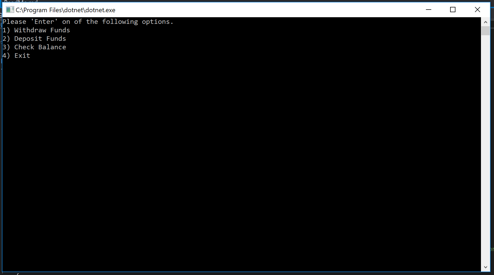
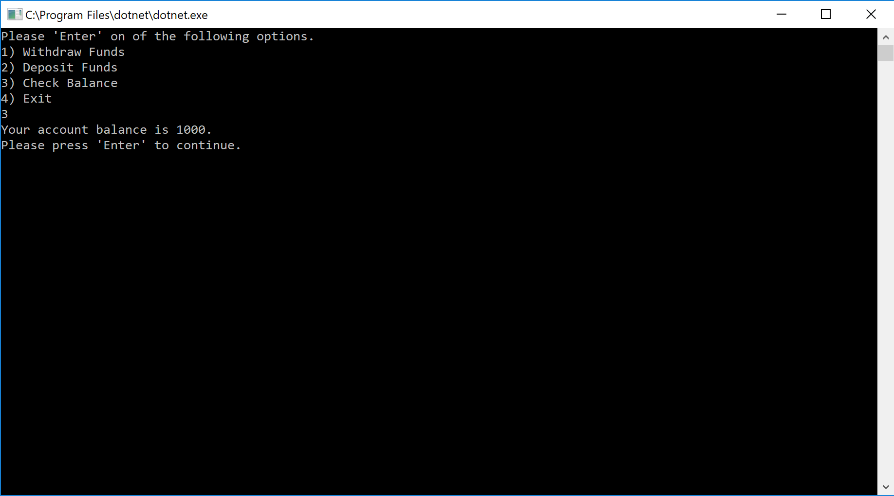
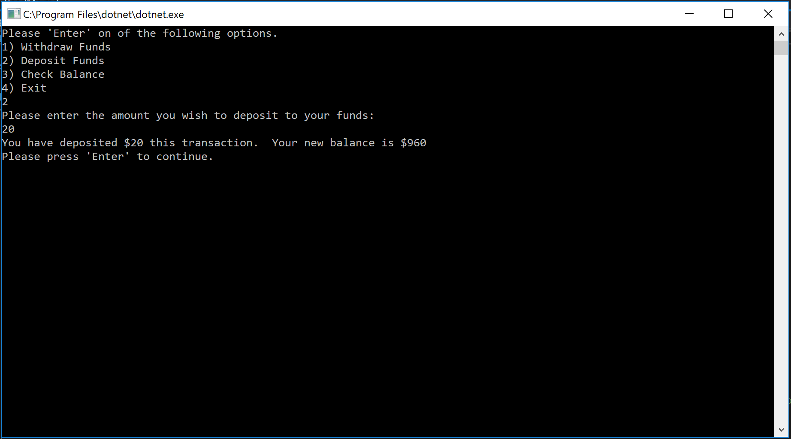

# Lab02-Unit Testing

------------------------------

# Unit Testinge
#### Lab02-Unit Testing
##### *Author: Mike Kelly*

------------------------------

## Description
This is a C# console application that will function like a regular ATM.  The user will start with $1000 and have the ability to withdraw, deposit, and check balance.  It will keep track of a running total for both Withdrawals and Deposits.

------------------------------

## Getting Started
Clone this repository to your local machine.
```
$ git clone [https://github.com/Michael-S-Kelly/Lab02-Unit-Testing.git]
```
#### To run the program from Visual Studio:
Select ```File``` -> ```Open``` -> ```Project/Solution```

Next navigate to the location you cloned the Repository.

Double click on the ```Lab02-Unit Testing``` directory.

Then select and open ```Lab02-Unit-Testing.sln```

------------------------------

## Visuals


##### Application Start

##### Checking Balance

##### First Withdrawal of the session

##### Withdrawals after the first

##### First Deposit of the session

##### Deposits after the first

##### Application End


------------------------------

## Change Log


------------------------------
## Collaborators, Contributors, and Other Resources used

### Collaborators

### Contributors
####Phil Werner


### Other Resources
####C# 7.0 Pocket Reference

------------------------------
For more information on Markdown: https://www.markdownguide.org/cheat-sheet